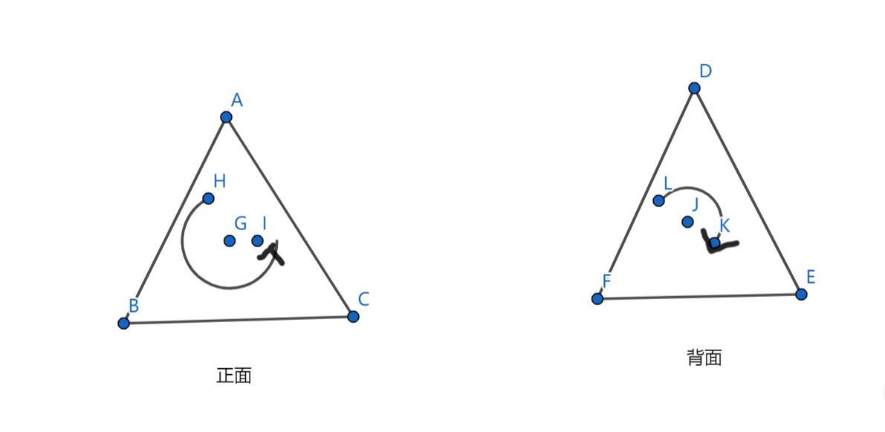
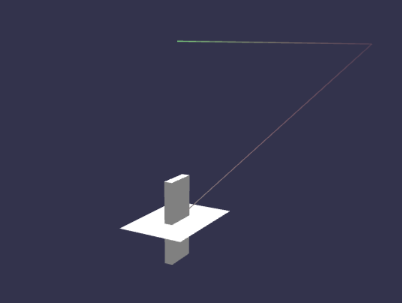

# *Lesson 2 MeshBuilder*

### 一、Mesh 是怎么构建出来的？

在上节课中，我们介绍了如何添加一个立方体到场景中并渲染到画布上。那么这个立方体是如何被构建出来的呢？我们又该如何控制他的尺寸呢？

记得上节课我们在构建立方体也就是调用 creatBox 方法的时候，传入了一个空的对象。其实可以通过它来控制立方体的一些属性，说明如表。

| option          | 值类型&说明                                             | 默认值                                    |
| --------------- | ------------------------------------------------------- | ----------------------------------------- |
| size            | (number) 立方体每一面的大小，也就是长宽高统一都是这个值 | 1                                         |
| height          | (number) 单独设置高度Y，覆盖size的高度                  | size                                      |
| width           | (number) 单独设置长度X，覆盖size的长度                  | size                                      |
| depth           | (number) 单独设置宽度Z，也称为深度，覆盖size的长度      | size                                      |
| sideOrientation | (number) 物体可被看到的面                               | 默认0，正面，可选：0 正面，1 背面，2 双面 |

这里要怎么理解 sideOrientation 呢？它涉及到了一个知识点：面剔除。面剔除是节省性能开销的一种有效方法，通过将看不见的面的片段舍弃，可减少50%以上的开销。判断一个三角形的正向需要根据其顶点的环绕顺序，默认情况下,顶点逆时针方向环绕为正向。



注意：如果选择正面，那么当相机位于物体的反面时，物体就被隐藏了，反之亦然。如果选择了双面，无论相机如何移动，物体都会被显示出来，这也是最耗费资源的方式。所以如何选择 sideOrientation 的值，需要根据具体的使用场景而定。

```
const myBox = BABYLON.MeshBuilder.CreateBox("myBox", {height: 5, width: 2, depth: 0.5,sideOrientation:2}, scene);
```

好了，到目前为止。我们已经基本了解了 creatBox 方法的使用，可是我们注意到这个方法是属于 MeshBuilder 的，既然可以它创建立方体是不是应该也可以创建别的图形呢？没错，就是可以！下面介绍几种其他可以创建的图形。

### 二、MeshBuilder 还可以创建哪些图形？

- **球体 Sphere**

```
// 创建默认球体
const sphere = BABYLON.MeshBuilder.CreateSphere("sphere", {}, scene); 
// 设置直径并创建
const mySphere = BABYLON.MeshBuilder.CreateSphere("mySphere", {diameter: 2, diameterX: 3}, scene);
```

| option          | 值类型&说明                                                  | 默认值                                    |
| --------------- | ------------------------------------------------------------ | ----------------------------------------- |
| segments        | (number) 水平分段数，决定了球体的精度，值越小棱角就越明显    | 32                                        |
| diameter        | (number) 球体通用直径，相当于XYZ方向都是同一个值             | 1                                         |
| diameterX       | (number) X轴直径, 覆盖diameter的X方向的值                    | diameter                                  |
| diameterY       | (number) Y轴直径, 覆盖diameter的X方向的值                    | diameter                                  |
| diameterZ       | (number) Z轴直径, 覆盖diameter的X方向的值                    | diameter                                  |
| arc             | (number) 圆周率(纬度方向切割)，取值范围0到1，0.5相当于一个半球 | 1                                         |
| slice           | (number) 高度比 (经度方向切割)，取值范围0到1，与arc类似，只是切割方向不一样 | 1                                         |
| sideOrientation | (number) 物体可被看到的面                                    | 默认0，正面，可选：0 正面，1 背面，2 双面 |

- **平面 Plane** 

```
// 创建默认平面
const plane = BABYLON.MeshBuilder.CreatePlane("plane", {}, scene); 
// 设置宽高并创建
const myPlane = BABYLON.MeshBuilder.CreatePlane("myPlane", {width: 5, height: 2}, scene);
```

| option          | 值类型&说明                                             | 默认值                                    |
| --------------- | ------------------------------------------------------- | ----------------------------------------- |
| size            | (number) 平面长度和高度，统一都是这个值，默认是个正方形 | 1                                         |
| width           | (number) 单独设置长度X，覆盖size的高度                  | size                                      |
| height          | (number) 单独设置高度Y，覆盖size的高度                  | size                                      |
| sideOrientation | (number) 物体可被看到的面                               | 默认0，正面，可选：0 正面，1 背面，2 双面 |

- **地面 Ground**

```
// 创建默认地面
const ground = BABYLON.MeshBuilder.CreateGround("ground", {}, scene); 
// 设置宽高并创建
const myGround = BABYLON.MeshBuilder.CreateGround("myGround", {width: 6, height: 4}, scene);
```

| **option** | **值类型&说明**     | 默认值 |
| ---------- | ------------------- | ------ |
| width      | (number) 地面的长度 | 1      |
| height     | (number) 地面的宽度 | 1      |

- **线条 Lines**

在 3D 世界中，线条由一系列分割的线段组成，它们首尾相连的排列在一起。从具体创建上来说，线条是由一系列的点组成。例如 (0, 0, 0), (0, 1, 1), (0, 1, 0) 这三个点会形成2条线段，把线段进行首尾相连，最后会形成一个弯折的线条。在 Babylon 中，这些点由是三维向量表示，会由 **BABYLON.Vector3** 对象进行初始化，然后把初始化好的点按顺序形成数组，最后传递给CreateLines 进行线条的绘制。

```
const myPoints = [
    new BABYLON.Vector3(0, 0, 0),
    new BABYLON.Vector3(0, 10, 10),
    new BABYLON.Vector3(0, 10, 0)
];
const colors = [
	new BABYLON.Color4(0.5, 0.5, 0.5, 1), // r g b a,取值范围 0-1
	new BABYLON.Color4(0.85, 0.5, 0.5, 0.2),
	new BABYLON.Color4(0.5, 0.85, 0.5, 1)
];
//创建一个线条
const lines = BABYLON.MeshBuilder.CreateLines("lines", {points: myPoints,colors:colors}, scene);
```

| option         | 值类型&说明                                                  | 默认值 |
| -------------- | ------------------------------------------------------------ | ------ |
| points         | (Vector3[]) 点的数组，绘制线条所需的点路径                   | null   |
| colors         | (Color4[]) 颜色的数组，一般与points一 一对应，定义每个点的颜色，两点之间线段的颜色由前一个点确定 | null   |
| useVertexAlpha | (boolean) 如果设置为false，则线条不支持透明度，会节省资源，增加渲染速度 | true   |

动动手尝试一下渲染出不同的形状吧，下面这张图s'w里我们选择渲染了 box、ground、 lines




