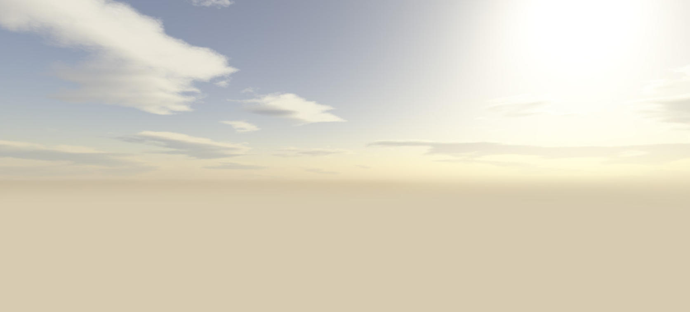

# *Lesson 8 SkyBox*


### 一、什么是天空盒？

一般来说天空盒是指一个笼罩住整个场景的巨大的盒子。这个笼罩住场景的盒子可以使用美术艺术家们做好的高清贴图，所以会使整个场景非常美观且具有氛围感。

首先用立方体包裹住场景，然后使用高清贴图渲染环境。

下面这个贴图就是一张天空盒的贴图，可以看出它其实是一个立方体的展开图。


### 二、babylon 中的天空盒

要想在 babylon 中使用天空盒，首先我们需要创建一个立方体。

```typescript
const skyBox = BABYLON.MeshBuilder.CreateBox("skyBox", {
            size: 2000.0
        }, scene),
```

接着，我们创建出这个立方体的材质。

```typescript
const skyBoxMaterial = new BABYLON.StandardMaterial("skyBox", scene);
// 因为，场景在盒子的内部，所以我们需要关闭掉材质的背面剔除，让我们在盒子内部也可以看到盒子。
skyBoxMaterial.backFaceCulling = false;
// 由前文可知，我们需要一张立方体的展开图来作为天空盒的贴图
// 而在 babylon 中，这张立方体的展开图被分为六张贴图并由 CubeTexture 加载器加载
// CubeTexture 加载的贴图只能被应用到 reflectionTexture 
skyBoxMaterial.reflectionTexture = new BABYLON.CubeTexture("./textures/cube/box", scene);
// reflectionTexture 的含义是反射贴图，而我们是想要获得一张天空盒的贴图
// 因此我们将 reflectionTexture 的模式进行修改
skyBoxMaterial.reflectionTexture.coordinatesMode = BABYLON.Texture.SKYBOX_MODE;
// 为了天空盒最终颜色输出完全按照贴图，将颜色改为黑色
skyBoxMaterial.diffuseColor = new BABYLON.Color3(0, 0, 0);
skyBoxMaterial.specularColor = new BABYLON.Color3(0, 0, 0);

```

最后，将材质赋值给立方体的材质属性。

```
skyBox.material = skyBoxMaterial;
```

至此，我们就得到了一个天空盒。




现在我们来说一下 reflectionTexture 这个属性，它原本的含义是反射贴图。比如一个立方体，想要反射环境，我们就可以使用这个属性，这个属性接收的是由 CubeTexture 加载器加载的贴图，它和我们加载天空盒很相似，所以，在 babylon 中直接使用了此属性来加载天空盒贴图，为了区别其不是普通的反射贴图，我们需要将贴图的coordinatesMode 属性改为 SKYBOX_MODE。不同的模式具有不同的映射算法，通常来说我们使用默认的立方体模式即可正确的反射环境。下面我们就加一个立方体试一下。

```typescript
const shape = BABYLON.MeshBuilder.CreateBox("shape", {}, scene),
    shapeMaterial = new BABYLON.StandardMaterial("mat", scene);
            
shapeMaterial.reflectionTexture = new BABYLON.CubeTexture("./textures/cube/box", scene);
shapeMaterial.diffuseColor = new BABYLON.Color3(0, 0, 0);
shapeMaterial.specularColor = new BABYLON.Color3(0, 0, 0);
shape.material = shapeMaterial;
```


