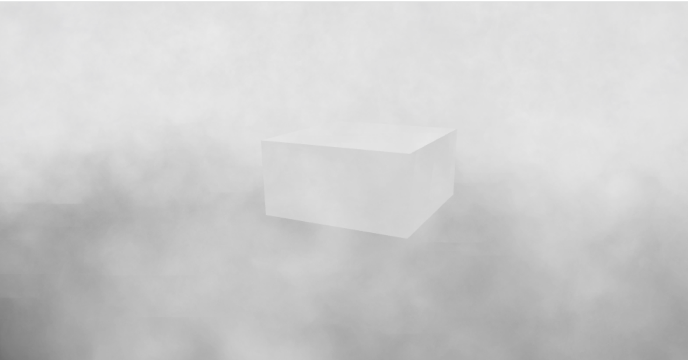

# *Lesson 9 Particle*

### 一、什么是 Particle 以及 Particle 的作用

这里我们借用一下物理学中对粒子的理解。**粒子**一般是指能够以自由状态存在的最小物质组成部分，如原子。而我们所说的粒子参考了这种微观的思想把一个物体分为若干个组成部分，每一个组成部分便是一个粒子（如果这个物体本身就很小，那么我们甚至可以不用拆分，直接把这个物体当成一个粒子）

那么，我们为什么要使用粒子呢？一个主要原因是为了让我们的场景看起来更加的真实。我们已经知道，现实世界是由微观的粒子组成的。我们平时观察到的宏观世界，在三维场景中很多都可以直接表现出来，如立方体。我们只需要按照顶点画出对应的面片并且渲染出来即可。但对于一些非固体而言，如果不借用粒子的思想，我们很难去描述他们的形状和变化过程，如*雨雪（如何下落），云雾，火焰，水流，爆炸效果*等等。

上面提到了一些可以依靠粒子来实现的效果，其实，在实际应用中还会有更多种多样的效果需要使用粒子来实现。如果我们每一种效果都从头开始去实现的话，那么工作量和难度无疑是巨大的。为了避免开发者重复造轮子，通常游戏引擎都会有自己的**粒子系统（particleSystem）**。粒子系统具有大量的属性，可以通过调整各个属性去模拟开发者实现想要实现的效果。 Banylon 也不例外，它也有自己的粒子系统。

### 二、在 Babylon 中使用 Particle

**e.g.1 利用粒子模拟喷泉效果**

```typescript
        // 创建发射器和粒子系统
		const emitter = BABYLON.MeshBuilder.CreateBox("", {}, scene),
            particleSystem = new BABYLON.ParticleSystem("particles", 2000, scene);

        emitter.position.y = 1;
        particleSystem.particleTexture = new BABYLON.Texture("./textures/flare.png", scene); // 粒子贴图
        // particleSystem.emitter = emitter; // 设置粒子发射器
        particleSystem.color1 = new BABYLON.Color4(0.7, 0.8, 1.0, 1.0);
        particleSystem.color2 = new BABYLON.Color4(0.2, 0.5, 1.0, 1.0);
        particleSystem.colorDead = new BABYLON.Color4(0, 0, 0.0, 0.0); // 粒子在其生命周期结束时的颜色  
        // 粒子的尺寸在[0.1,0.8]内随机
        particleSystem.minSize = 0.1;
        particleSystem.maxSize = 0.8;
        // 粒子的生命周期在[0.3,1]内随机
        particleSystem.minLifeTime = 0.3;
        particleSystem.maxLifeTime = 1;
        // 发射器的速率（一帧释放的粒子数）
        particleSystem.emitRate = 1000;
        // 每个粒子发射后的随机方向，位于 direction1 和 direction2 之间
        particleSystem.direction1 = new BABYLON.Vector3(-2, 8, 3);
        particleSystem.direction2 = new BABYLON.Vector3(2, 8, -3);
        particleSystem.updateSpeed = 0.02; // 整体更新速度(0.01是默认的更新速度。更新越快,动画越快)  

        particleSystem.start(); // 启动粒子系统
```

**e.g.2 利用粒子模拟体积雾效果**

上面的例子我们使用的是 CPU 粒子，当我们的粒子数量到了一定的量级的时候，继续使用 CPU 粒子，设备性能可能不足以保障程序的流畅运行。这个时候我们可以使用 GPU 粒子，它是 babylon 利用 webgl2 的新特性制作出来的（未特殊说明的，皆是使用的webgl1），也就是说我们需要先检测一下浏览器是否支持 GPU 粒子。

```typescript
        let particleSystem: BABYLON.GPUParticleSystem | BABYLON.ParticleSystem; 

        if (BABYLON.GPUParticleSystem.IsSupported) { // 判断是否支持 GPU 粒子
            particleSystem = new BABYLON.GPUParticleSystem("particles", { capacity: 20000 }, scene);
            particleSystem.activeParticleCount = 5000;
            particleSystem.manualEmitCount = particleSystem.activeParticleCount;
            particleSystem.minEmitBox = new BABYLON.Vector3(-25, 12, -25);
            particleSystem.maxEmitBox = new BABYLON.Vector3(25, 1, 25);
        } else {
            particleSystem = new BABYLON.ParticleSystem("particles", 2500, scene);
            particleSystem.manualEmitCount = particleSystem.getCapacity();
            particleSystem.minEmitBox = new BABYLON.Vector3(-25, 12, -25);
            particleSystem.maxEmitBox = new BABYLON.Vector3(25, 1, 25);
        }

        particleSystem.particleTexture = new BABYLON.Texture("./textures/smoke_15.png", scene);
        particleSystem.color1 = new BABYLON.Color4(0.8, 0.8, 0.8, 0.1);
        particleSystem.color2 = new BABYLON.Color4(.95, .95, .95, 0.35);
        particleSystem.colorDead = new BABYLON.Color4(0.9, 0.9, 0.9, 0.1);
        particleSystem.minSize = 3.5;
        particleSystem.maxSize = 5.0;
        particleSystem.minLifeTime = Number.MAX_SAFE_INTEGER;
        particleSystem.emitRate = 10000;
        particleSystem.blendMode = BABYLON.ParticleSystem.BLENDMODE_STANDARD;
        particleSystem.direction1 = new BABYLON.Vector3(0, 0, 0);
        particleSystem.direction2 = new BABYLON.Vector3(0, 0, 0);
        particleSystem.minAngularSpeed = -1; // 发射粒子的最小角速度(每个粒子的z轴旋转)。  
        particleSystem.maxAngularSpeed = 1; // 发射粒子的最大角速度(每个粒子的z轴旋转)。  
        particleSystem.updateSpeed = 0.01;

        particleSystem.start();
```



**e.g.3 使用精灵实现雨雪粒子效果**

前面两个示例都是使用了 babylon 的粒子系统来实现粒子效果，这个例子我们来使用精灵实现一个雨雪的粒子效果。可能你会有些疑问，既然我们已经可以使用粒子系统来快速、简单的实现粒子效果，那么我们为什么还要去使用精灵来说实现一个粒子效果呢？这是因为在一些使用场景中，我们会需要场景尽量的符合物理规律，而如果仅是靠肉眼调节的粒子系统很难保证这一点。故而我们不妨使用精灵来实现粒子效果，这样的话，我们可以去计算一些方程、公式，通过参数的调节来使场景更加的符合物理规律。

```typescript
import { Base, Sprite } from "./base";

export class RainAndSnow extends Base {

    /** 风速 */
    public windSpeed: BABYLON.Vector3 = new BABYLON.Vector3();
    /** 重力加速度 */
    public gravitationalA: BABYLON.Vector3 = new BABYLON.Vector3(0, -9.81, 0);
    /** 空气阻力比例系数 */
    public airDragK: number = 1.0; // 雪花建议:1.0; 雨滴建议:0.05
    /** 质量(单位: kg) */
    public mass: number = 0.001;
    /** 直径(单位: m) */
    public diameter: number = 0.005;

    /** 地面精灵数量 */
    private _groundSpriteCount: number = 0;

    /**
     * 构造函数
     */
    public constructor() {
        super();
    }

    /**
     * 初始化
     */
    protected _init(): void {

        super._init();

        const { engine, scene } = this;

        const snowManager: BABYLON.SpriteManager = new BABYLON.SpriteManager("SpriteManager", "./textures/snow.png", 10000, { width: 8, height: 8 }, scene);

        for (let i = 0; i < 10000; i++)
            this._addSprite(snowManager, Math.floor(new Date().getTime() + i / 10));

        engine.runRenderLoop((): void => {

            if (this._groundSpriteCount < this.sprites.length) this._SpriteMigration();

            scene.render();

        });

    }

    /**
     * 添加精灵
     * @param spriteManager 精灵管理器
     */
    private _addSprite(spriteManager: BABYLON.SpriteManager, time: number = new Date().getTime()): void {

        const sprite = new BABYLON.Sprite("sprite", spriteManager),
            groundX = this.ground._boundingInfo.boundingBox.extendSize.x * 2,
            groundY = this.ground._boundingInfo.boundingBox.extendSize.x * 2;

        sprite.cellIndex = 0;
        sprite.position.x = Math.random() * groundX - groundX / 2;
        sprite.position.y = 40;
        sprite.position.z = Math.random() * groundY - groundY / 2;
        sprite.size = 0.1;

        this.sprites.push({
            content: sprite,
            time: time,
            velocity: new BABYLON.Vector3(),
            isStop: false
        });

    }

    /**
     * 精灵移动
     */
    private _SpriteMigration() {

        const time: number = new Date().getTime(),
            deltaTime = 0.01,
            length = this.sprites.length;

        if (time - this._currentTime > deltaTime * 1000) {

            for (let i = 0; i < length; i++) {

                const sprite: Sprite = this.sprites[i],
                    position: BABYLON.Vector3 = sprite.content.position,
                    size: number = sprite.content.size,
                    totalTime: number = (time - sprite.time) / 1000;

                if (position.y > size / 2) {
                    totalTime > 0 && this._computeSpritePosition(sprite, totalTime, deltaTime);
                } else {

                    position.y = size / 2;

                    if (!sprite.isStop) {

                        sprite.isStop = true;

                        this._groundSpriteCount += 1;

                    }

                }

            }

        }

    }

    /**
     * 计算精灵位置
     * @param sprite 精灵
     * @param totalTime 总时长
     * @param deltaTime 间隔时间
     */
    private _computeSpritePosition(sprite: Sprite, totalTime: number, deltaTime: number) {

        const acceleration = this.gravitationalA.y - this.airDragK * sprite.velocity.y * this.diameter / this.mass;
        if (acceleration < 0) sprite.velocity.y = acceleration * totalTime;

        const content = sprite.content;
        content.position.x += this.windSpeed.x * deltaTime * 0.5;
        content.position.y += sprite.velocity.y * deltaTime;
        content.position.z += this.windSpeed.z * deltaTime * 0.5;
        content.angle += 0.05 * Math.random();

    }

}
```

