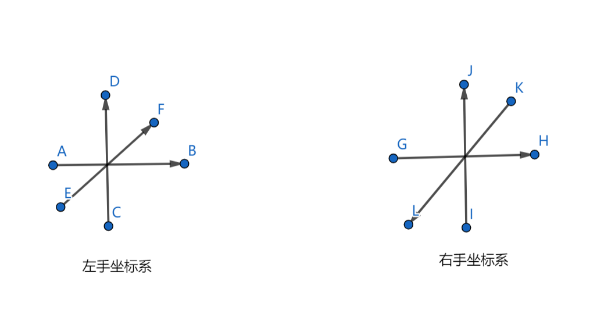
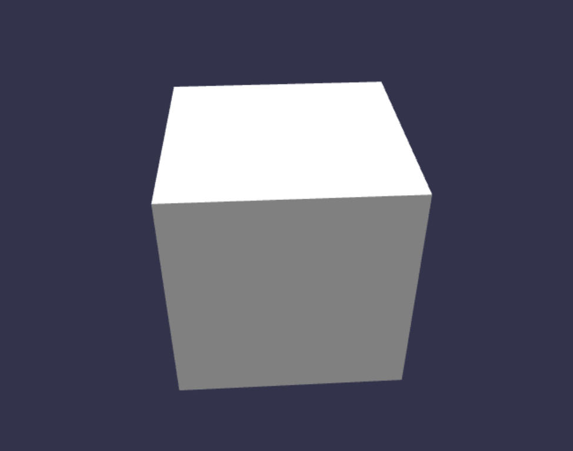

# ***Lesson 1 Hello world***

### **一、什么是 WebGL 以及 WebGL 能做什么？**
WebGL  规范由 Khronos Group 协会在2011年3月的美国洛杉矶举办的游戏开发大会上发布，允许把 JavaScript 和 OpenGL ES 2.0 相结合 HTML 5 Canvas，提供硬件 3D 加速渲染，使开发人员可以借助系统显卡在浏览器里展现 3D 场景和模型，使用者在不安装插件的情况下便可以体验 3D 图形技术。

WebGL 允许开发者在浏览器中实现实时的 3D 互动图形。可以应用于互动音乐、互动视频、游戏、数据可视化、艺术创作、空间建模、绘制数学图像、物理模拟等等。

### **二、什么是 babylon？**

 世界上最强大、最漂亮、最简单的 Web 渲染引擎之一。对所有人完全开放和免费。尽可能简单，让每个人都能将他们的想法变为现实。

### **三、babylon 对比 three 的优势**
+  typescript
+  功能丰富，文档清晰。强大的 3D 游戏引擎
+  背景优势，babylon 是微软的一个团队在做，three 是 mrdoob 由 actionscriot 开发后迁移到 webgl 上来的。虽然 three 的社区庞大，但从架构的合理性已经项目的可维护性来讲 babylon 都有不小的优势

### **四、让我们开始吧！**
1.  环境配置 https://doc.cnbabylon.com/2-0-first-steps/

2.  认识 3D 世界
    +  三要素：*场景、摄像机、渲染引擎*
        +  *Scene（场景）*：用于 babylon 的视觉展示，相当于 canvas2d 的 Context，可以往其中添加3d物体
        +  *Camera（摄像机）*：负责对场景的拍摄，可以通过操作摄像机的方式来改变观察者的位置和朝向
        +  *Engine（渲染引擎）*：负责将摄像机拍到的场景最终渲染到屏幕上
        
    +  *Mesh（物体）*：通常作为场景的子节点，是具体的显示内容。由几何体和材质组成
       
        +  *Geometry（几何体）*：记录了渲染一个 3D 物体所需要的基本数据，如不可缺少的顶点数据
        +  *Material（材质）*：用来美化物体，使其具备更加真实或者其他我们想要实现的效果。可以参考 LOL 中的英雄，如果没有材质的话，那将很难展示英雄的细节。简单理解，一个英雄更换了材质就相当于更换了一个皮肤（当然实际上，更换了皮肤可不止更换了材质那么简单）
        
    +  常用操作：*位移、旋转、缩放*
       
        +  *Position（位置）*：用来描述物体的空间位置。babylon 允许通过改变物体 Position x,y,z 三个轴的方式来使物体进行位移。当然还有一些进阶的玩法来使物体位移，这可以在我们以后的课程中学习
        +  *Rotation（旋转）*：用来描述物体的旋转角度，分为 x,y,z 三个轴向。改变角度即可使物体沿对应轴进行旋转（注意，这里的单位使用的是弧度，角度转弧度公式 1° = π /180）
        +  *Scaling（缩放）*：用来描述物体的缩放大小，分为 x,y,z 三个轴向。改变缩放值即可使物体沿对应轴进行缩放
        
    +  两个坐标系：*世界坐标系*  和 *局部坐标系*（babylon 中使用的坐标系是左手系）
        +  *世界坐标系*：世界坐标系是一个原点永远不变的坐标系，相机、场景中的物体都是在世界坐标系中的。
        
        +  *局部坐标系*：局部坐标系的原点始终位于物体的创建中心，物体的旋转和放大中心都位于局部坐标系的原点。局部坐标系的原点会跟随物体的位移，对应的在世界坐标系中局部坐标系原点的坐标也会改变。
        
          
        
    +  Vector（向量）：也称为欧几里得向量、几何向量、矢量，指具有大小和方向的量。它可以形象化地表示为带箭头的线段。箭头所指：代表向量的方向；线段长度：代表向量的大小。与向量对应的量叫做数量（物理学中称标量），数量（或标量）只有大小，没有方向。babylon 中的向量主要以坐标形式表述。
    
3.  一个 sample

    第一节我们的目标是创建一个三维场景，放入一个立方体，而且我们可以通过操控相机来改变立方体在画布上的呈现。
    
    首先我们要做的是，找到 canvas 容器并且给定它的宽高。
    
    ```
    const canvas: HTMLCanvasElement = document.querySelector('canvas.webgl');
    canvas.height = window.innerHeight;
    canvas.width = window.innerWidth;
    ```
    
    然后初始化三要素（场景、相机、引擎）。
    
    ```
    const engine = new BABYLON.Engine(canvas, true), // 参数1传入 canvas，参数2指定是否开启抗锯齿
        scene = new BABYLON.Scene(engine),
        camera = new BABYLON.ArcRotateCamera('camera' -Math.PI / 2, Math.PI / 2, 2, new BABYLON.Vector3(0, 0, 0), scene); // 参数1定义相机的name，参数2定义相机沿y轴的旋转弧度，参数3定义相机沿x轴的旋转弧度，参数4定义相机与目标的距离，参数5定义相机的目标，参数6定义相机所属的场景
    ```
    
    绑定对相机的控制（用于交互）。
    
    ```
    camera.attachControl(canvas, true);
    ```
    
    接着加入一个灯光到场景中，你很难想象这世界没有光该是什么样（当然我猜好奇的你一定会把灯光去掉看一看）。
    
    ```
    new BABYLON.HemisphericLight('light1', new BABYLON.Vector3(0, 1, 0), scene); // 参数1灯光 name，参数2灯光位置，参数3灯光所在的场景
    ```
    
    一切都准备好了。下面创建我们的立方体吧！
    
    ```
    BABYLON.MeshBuilder.CreateBox('box', {}, scene); // 参数1 mesh name，参数2 box 的一些参数，这里传入空对象，让其使用默认值
    ```
    
    最后我们只需要调用 scene的 render 方法就可以让立方体渲染到画布上了。
    
    ```
    scene.render();
    ```
    
    不过为了让它变得可以交互，我们通常需要每一帧都重绘一遍（想像如果每一帧画面都一样的话，不就变成照片了嘛！不论我们怎么操作，画面都不会再发生改变了），这里我们可以调用 engine 的 runRenderLoop 方法。把上述代码改写为：
    
    ```
    engine.runRenderLoop(() => {
    	scene.render();
    });
    ```
    
    哦，对了！因为我们的画布是在浏览器上面，这样画布的大小可能会随着浏览器大小而改变。在这种情况下，画布里的内容就可能发生形变。好在 babylon 已经想到了这种情况，我们只需要监听浏览器的 resize 事件，然后调用 engine 的 resize 方法即可。
    
    ```
    window.addEventListener('resize', () => {
        engine.resize();
    });
    ```
    
    好啦，如果不出意外的话，你将看到类似下面这张图片的图像，并且可以尝试动动鼠标操控它。
    
    

